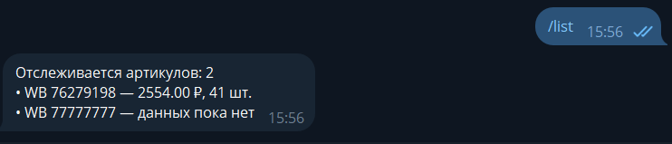
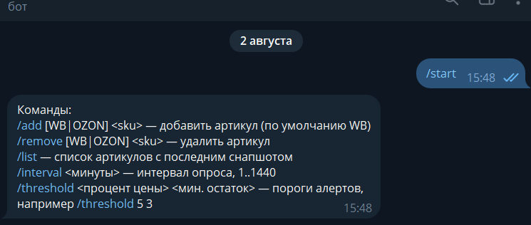
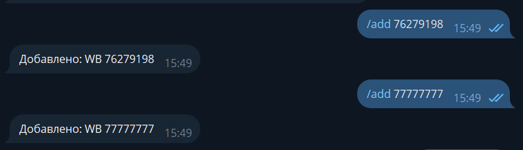
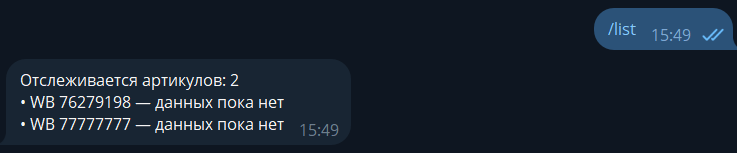
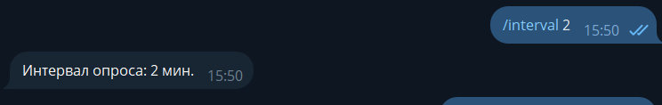

# wb-price-monitor

Мониторинг цен и остатков конкурентов на маркетплейсах с алертами в Telegram.



<details>
<summary>Полная демо-переписка с ботом (7 скриншотов)</summary>

| | |
|---|---|
|  |  |
|  |  |
|  |  |
|  | |

Последний скриншот — живой fail-алерт: артикул `77777777` не существует, бот честно
сообщил о 5 неудачных попытках подряд вместо того, чтобы тихо молчать или падать.
</details>

## Для кого

Для продавцов на Wildberries и Ozon, которые вручную проверяют карточки конкурентов.
Бот делает это сам: следит за списком артикулов и пишет в Telegram, когда у конкурента
изменилась цена, остаток упал ниже порога или товар пропал/вернулся в наличие.

## Что умеет

- Опрос списка артикулов по расписанию, интервал меняется на лету командой `/interval`
- Алерт при изменении цены больше чем на настраиваемый процент (`/threshold`)
- Алерт при остатке ниже порога и при переходе остатка через ноль (`0 → N` и `N → 0`)
- Управление списком артикулов прямо из чата: `/add`, `/remove`, `/list`
- История всех снапшотов в PostgreSQL — основа для графиков и аналитики
- Устойчивость к сбоям: retry с экспоненциальной паузой (1s → 3s → 9s), изоляция ошибок
  по каждому артикулу, отдельный алерт «не могу получить данные» после 5 неудач подряд

## Команды бота

| Команда | Что делает |
|---|---|
| `/add [WB\|OZON] <sku>` | Добавить артикул в мониторинг (по умолчанию WB) |
| `/remove [WB\|OZON] <sku>` | Убрать артикул из мониторинга |
| `/list` | Список артикулов с последней известной ценой и остатком |
| `/interval <минуты>` | Интервал опроса, от 1 до 1440 минут |
| `/threshold <%> <шт>` | Пороги алертов: изменение цены в процентах и «мало осталось» в штуках |

Бот односользовательский: команды выполняются только для `OWNER_CHAT_ID`, любой другой
чат получает `⛔ Not authorized.`

## Запуск

```bash
git clone https://github.com/reolicjthyder/wb-price-monitor.git && cd wb-price-monitor
cp .env.example .env
# вписать TELEGRAM_BOT_TOKEN и TELEGRAM_BOT_USERNAME (от @BotFather),
# OWNER_CHAT_ID (от @userinfobot) и POSTGRES_PASSWORD
docker compose up --build -d
```

Поднимаются два контейнера: `app` и `postgres`. Схема БД накатывается Flyway при старте.
Проверка: напишите боту `/list` — он ответит сразу, пустой список это нормально.

## Архитектура

```
Telegram  ──long polling──►  TelegramBotHandler ──► SkuRepository / BotConfigService
                                    ▲
                                    │ alert
   @Scheduled ──► Poller ──► MarketplaceClient ──┬─► WbClient   (реальный WB API)
                    │                            └─► OzonClient (заглушка)
                    └──► PriceSnapshotRepository ──► AlertEngine
```

- **Poller** — раз в минуту тикает и опрашивает артикулы, если прошёл настроенный интервал
- **AlertEngine** — чистая функция: сравнивает два последних снапшота с порогами из `bot_config`
- **MarketplaceClient** — интерфейс, по которому маршрутизируются артикулы разных маркетплейсов
- **PostgreSQL** — `sku`, `price_snapshot` (полная история), `bot_config` (пороги и интервал)

Стек: Java 17, Spring Boot 3.3, PostgreSQL 16 + Flyway, TelegramBots, Docker Compose.

## Источник данных

Цена и остаток берутся из внутреннего JSON-API карточек Wildberries
(`https://card.wb.ru/cards/v4/detail`) — без headless-браузера и HTML-парсинга,
поэтому опрос быстрый и дешёвый.

## Ограничения текущей версии

- **Ozon — заглушка.** `OzonClient` возвращает рандомизированные демо-данные. Архитектура
  готова к расширению: подключение реального Ozon — это новая реализация интерфейса
  `MarketplaceClient`, `Poller` и `AlertEngine` при этом не меняются.
- Один владелец (`OWNER_CHAT_ID`). Схема БД уже содержит `chat_id` во всех таблицах,
  так что переход на несколько пользователей не потребует миграции данных.
- **Требует сетевого доступа к внутреннему API WB без ограничений.** В зависимости от
  географии хостинга доступность может отличаться. Механика бота (команды, алерты,
  хранение истории, обработка сбоев) полностью протестирована и работает из любой точки —
  см. скриншоты выше, включая живой fail-алерт при недоступности данных по артикулу.

## Дальнейшее развитие

- Реальная интеграция Ozon Seller API
- Fallback-парсер на Selenium/Jsoup на случай, если внутренний API WB закроют
- REST API и веб-панель как альтернатива Telegram-командам
- Графики динамики цен по накопленной истории `price_snapshot`
- Индивидуальные пороги алертов на каждый артикул (сейчас пороги общие для владельца)

## Тесты

```bash
./mvnw test
```

Unit-тесты пороговой логики `AlertEngine`, интеграционные тесты `WbClient` на WireMock
(включая ретраи и неожиданный формат ответа), тесты репозиториев на реальном PostgreSQL
через Testcontainers. Живая сеть в тестах не используется.
